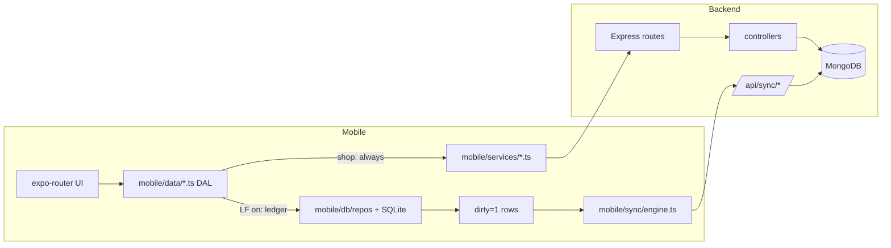

# Phase 1 Audit Addendum — Shop Local-First

**Date:** 2026-09-12
**Branch:** `feat/local-first-sync`
**Method:** Fresh direct code read (no assumptions from master doc). Every claim below cites a file. Status labels: **Complete** | **Partial** | **API-only** | **Missing** | **Broken** | **Doc drift**.
**Scope:** Audit only. No application code changed. Awaiting approval before Phase 2.

This file re-verifies section B of [`SHOP_LOCAL_FIRST_MASTER.md`](./SHOP_LOCAL_FIRST_MASTER.md) and is the Phase 1 exit artifact required by section H.

---

## 0. Headline verdict

- The **Personal Cash Book local-first ledger is real and complete** (accounts, categories, parties, transactions, transfers, sync engine, balances). It must be treated as frozen.
- The **shop side is ~100% online-only**. There are **no local shop tables, no local shop repos, no shop sync entities, and no shop DAL routing**.
- The **product↔invoice↔stock chain is broken end-to-end**: the mobile invoice form cannot attach a product id to a line item, so the backend never creates `StockMovement` rows or cost basis from the UI.
- **No COGS / P&L** exists anywhere in code.
- Two **pre-existing backend accounting bugs** were found in invoice posting (account balance write path, credit-sale receivable).

**Master-doc section B is accurate**, with a handful of refinements and one correction (B.6 "Barcode scan UI — fix actual bug" is under-specified; the real gap is that the invoice line-item scanner never consults the local catalog or the product-barcode API at all).

---

## 1. Architecture summary (as-is)



Two coexisting data paths:

| Path | Entities | Storage | Backend needed for daily use? |
|------|----------|---------|-------------------------------|
| Local-first ledger | account, category, party, transaction, transfer | SQLite + async sync | No |
| Shop (products, invoices, stock, org settings) | product, invoice, stock movement, organization | Mongo via REST | **Yes today** |

Flags (code defaults, `mobile/lib/local-first/flags.ts:27`): LF **ON**, cloud sync **ON**, dual-write **OFF**, Drive backup OFF. `LOCAL_SCHEMA_VERSION = 2` (`mobile/db/types.ts:2`).

---

## 2. Entity / DB map

### 2.1 SQLite (`hisabboi_local.db`, schema v2)

Tables created by `mobile/db/migrations/index.ts` (MIGRATION_001 + 002):

| Table | Present | Sync status columns | Notes |
|-------|---------|---------------------|-------|
| `meta` | ✅ | n/a | cursors, owner, clock offset (`mobile/db/meta.ts:53`) |
| `accounts` | ✅ | v2 columns | |
| `categories` | ✅ | v2 columns | |
| `parties` | ✅ | v2 columns | org-scoped via `organization_id` |
| `transactions` | ✅ | v2 columns | |
| `transfers` | ✅ | v2 columns | |
| `sync_conflicts` | ✅ | n/a | LWW conflict log |
| `products` | ❌ Missing | — | |
| `inventory_movements` / `stock_movements` | ❌ Missing | — | |
| `invoices` / `invoice_items` | ❌ Missing | — | |
| `organizations` (settings cache) | ❌ Missing | — | org meta is API-only |

Every syncable table carries: `id` (local UUID PK), `server_id`, `organization_id`, `admin`-equivalent via owner, `dirty`, `sync_status`, `retry_count`, `last_sync_error`, `sync_version`, `client_request_id`, `device_id`, `created_at/updated_at/deleted_at`. Shop tables must copy this shape exactly.

### 2.2 Backend models

| Model | File | Shop relevance |
|-------|------|----------------|
| `Product` | `backend/models/Product.js` | `purchase_price`, `sale_price`, `current_stock`, `opening_stock`, `low_stock_threshold`, `track_inventory`, `barcode` (indexed **sparse, not unique**), `sku` (unique per admin/org), `tax_rate`, `images`, `is_active`, `is_deleted`. **No `additional_cost` / `cost_price`.** |
| `Invoice` | `backend/models/Invoice.js` | types **only `sale`\|`purchase`** (`:9`); item fields: `description, quantity, unit, unit_price, discount, discount_type, tax_rate, subtotal/discount_amount/tax_amount/total, category_id, product, barcode, notes`. **No `unit_cost_at_sale`.** |
| `StockMovement` | `backend/models/StockMovement.js` | types `purchase,sale,purchase_return,sale_return,adjustment_in,adjustment_out,opening_stock`; `quantity` signed, `unit_cost`, `stock_after`, `invoice`, `party`. |
| `Organization` | `backend/models/Organization.js` | = Shop (v1). `settings` has `currency_code, currency, currency_symbol, locale, date_format, financial_year_start, invoice_prefix, invoice_next_number, allow_negative_balance, require_counterparty, auto_create_ledger`. |
| `Party` | `backend/models/Party.js` | `customer\|supplier\|both`, `current_balance` semantics documented `:66`, org-scoped. |
| `Account` | `backend/models/Account.js` | balance field is **`current_balance`** (`:34`) — relevant to bug R3. |
| `Transaction` | `backend/models/Transaction.js` | no hooks; balance side-effects live in controllers/sync only. `client_request_id` unique index `:198`. |

---

## 3. API map

Mounted in `backend/routes/index.js`. Shop-relevant:

| Area | Endpoints | File |
|------|-----------|------|
| Products | `GET /products/options`, `GET /products/stats`, `GET /products/barcode/:barcode`, `POST/GET/PATCH/DELETE /products[/:id]`, `POST /products/:id/adjust-stock`, `GET /products/:id/stock-movements` | `backend/routes/product.routes.js` |
| Invoices | `GET /invoices/options`, `GET /invoices/summary`, CRUD `/invoices`, `POST /invoices/:id/payments`, `POST /invoices/:id/cancel` | `backend/routes/invoice.routes.js` |
| Organizations | CRUD `/organizations`, members, `POST /organizations/switch` | `backend/routes/organization.routes.js` |
| Sync | `POST /sync/handshake`, `POST /sync/push`, `GET /sync/pull?since&scope`, `POST /sync/ack` | `backend/routes/sync.routes.js` |
| Reports | `GET /reports/summary\|series\|accounts-balances\|top-categories` — **transaction-based only; no inventory/COGS/P&L** | `backend/routes/report.routes.js` |

Mobile service layer: `mobile/services/products.ts`, `mobile/services/invoices.ts`, `mobile/services/organizations.ts` — all thin REST wrappers via `mobile/lib/api.ts`. Hooks `use-products.ts` / `use-invoices.ts` are TanStack Query over those APIs with **no local branch**.

---

## 4. Product / barcode / invoice analysis

### 4.1 Product CRUD — API-only

- Screens `mobile/app/(app)/shop/products.tsx`, `products/create.tsx`, `products/[productId].tsx` use `useProducts`/`useProduct`/`useCreateProduct`/`useUpdateProduct`/`useAdjustStock` → REST only.
- Dashboard `mobile/app/(app)/shop/index.tsx:88` uses `useProductStats` (online `GET /products/stats`) and `invoicesApi.getSummary` (online) for today's sales/purchases.
- No `mobile/data/products.ts` or `products.local.ts` exists.

### 4.2 Barcode — scanner exists, but the intended POS behavior does not

- Scanner component: `mobile/components/invoices/barcode-scanner-modal.tsx` (expo-camera `CameraView`, permission handling, torch, cooldown).
- Used **only** on product create/edit (`shop/products/create.tsx:352`, `shop/products/[productId].tsx:661`) to fill the barcode text field.
- External lookup utility `mobile/lib/barcode-lookup.ts` hits Open Food/Beauty/Pet/Products Facts + UPC Item DB (free, no key) — compliant with the "free only" policy.
- In the invoice line-item flow (`mobile/components/invoices/line-item-fields.tsx:67`), scanning does **external lookup only** and writes the result to `description`. It never:
  - queries the local product table (doesn't exist),
  - calls `GET /products/barcode/:barcode` (which does exist, `product.controller.js:184`),
  - links a product id to the line,
  - increments quantity on a repeated scan (no `qty++` merge).
- Backend `barcode` index is `{ barcode: 1 }` **sparse but not unique** (`Product.js:162`); duplicate barcodes within an org are possible, so a local "unique per org when set" index is a schema addition, and scan resolution must be deterministic.

**Verdict:** barcode is **Partial** as a data field, but the master-doc G.7 acceptance ("same barcode rescan → qty++", "create product if missing", "local hit first") is **Missing**.

### 4.3 Invoice create — product linkage is dropped (root cause of no stock/COGS)

1. `line-item-fields.tsx:60` sets `items.${index}.product_id` via an `any` cast.
2. The form schema `mobile/lib/validations/invoice.ts:6` (`lineItemSchema`) has **no** `product`/`product_id` field.
3. `transformInvoiceFormData` (`mobile/lib/invoice-utils.ts:121`) maps only `description, quantity, unit_price, tax_rate` — **drops product id**.
4. Backend `createInvoice` only creates a `StockMovement` when `item.product` is set (`invoice.controller.js:200`), and the model field is `product` (not `product_id`).

Net effect: from the UI, **invoices are free-text lines**. No stock in/out, no per-line cost basis, no product history — even online. `CreateInvoiceParams`/`InvoiceLineItem` in `mobile/services/invoices.ts` likewise omit product fields.

The product search modal (`components/invoices/product-search-modal.tsx`) does fetch products and prefill description/price (`line-item-fields.tsx:52`), so the UI looks connected, but the id never survives submit.

### 4.4 Invoice numbering & shop settings

- Numbering is server-authoritative: `Invoice.generateInvoiceNumber` reads/increments `Organization.settings.invoice_next_number` (`backend/models/Invoice.js:404`); personal invoices use `count+1` (`invoice.controller.js:99`). **No offline numbering, no idempotent allocation.**
- Mobile `OrganizationSettings` type exposes only `currency, currency_code, locale, fiscal_year_start, date_format, time_format` (`mobile/services/organizations.ts:3`) — no `invoice_prefix`/`invoice_next_number`/tax. Runtime object is the raw `o.settings` (`app/_layout.tsx:59`), so the data is present but untyped/unused.
- Offline org fallback in `app/_layout.tsx:79` derives org ids from `transactions` only and assigns `settings: {}` + generic names ("Organization"). So shop settings are not available offline.

### 4.5 Invoice PDF

`mobile/services/reports.ts:1836 exportInvoicePdf()` fetches via `invoicesApi.get` (`:1838`) — **online-only**. It must be repointed at a local invoice source for G.10.

---

## 5. Ledger analysis (must not break)

### 5.1 What is complete

- Repos + DAL + sync + balance recompute for the 5 ledger entities. DAL routing pattern: `mobile/data/accounts.ts` (`shouldUseLocalPersonalLedger` → `*.local.ts` → `notifyLocalLedgerMutation`). Parties follow the same pattern (`mobile/data/parties.ts`), and invoice-create party/account pickers already use it (`app/(app)/invoices/create.tsx:114,130,148`).
- Balances are derived locally: `mobile/db/balances.ts` recomputes from opening + paid transactions (dues excluded).
- Sync is `handshake → push → pull(scope=all) → ack → recalculateBalances` (`mobile/sync/engine.ts:275`), with LWW conflict resolution and `sync_conflicts` logging.
- Financial safety: server ignores client `current_balance` and applies `$inc` from transactions (`sync.controller.js:209,348,598`).

### 5.2 Accounting effects of invoices today (backend REST)

| Path | Account cash | Party balance | Stock |
|------|--------------|---------------|-------|
| Sale/purchase with initial payment + account | **Broken** — writes `accountDoc.balance` (non-schema) instead of `current_balance` (`invoice.controller.js:163-167`) | Not updated | Only if `item.product` (never sent by UI) |
| Sale/purchase on credit (`payment_mode: due`) | — | **Not updated** — only `total_invoices++` (`invoice.controller.js:233`) | Only if `item.product` |
| `recordPayment` | ✅ updates `current_balance` (`:566`) | ✅ `-amount` for both types (`:590`) | — |
| `cancelInvoice` | — (blocked if any payments, `:653`) | — | reverse movement only if `item.product` |

Two additional observations:
- A "cash" invoice with **no** `initial_payment_account` still records an invoice payment and marks the invoice paid, but creates **no ledger transaction** → revenue recognized with no cash movement.
- `createInvoice` is **not** transactional (no Mongo session), unlike `recordPayment`; a failure between invoice create and stock/payment leaves partial state.
- Sales stock movements store `unit_cost = product.purchase_price` **at posting time** (`invoice.controller.js:220`) — historical cost drifts when the catalog price changes, contradicting master-doc §E.4.

### 5.3 Local ledger gaps for shop linkage

- `recalculateBalances` only sums `transactions`; shop-generated ledger rows must be created as normal local transactions (with `invoice_id`/`product_id` linkage in `meta_data_json` or a new column) so balances and reports keep working.
- `notifyLocalLedgerMutation` fires only for ledger writes; a shop write that also touches ledger must trigger sync for both.
- `countPendingDirty` (`sync/pending.ts:3`) and `wipeAllLedgerData` (`db/client.ts:100`) enumerate only the 5 ledger tables — both must be extended or shop rows will be invisible to the sync badge and survive wipes.
- Backup v3 (`services/local-backup.ts:108`) and cloud→local migrate (`services/migrate-cloud.ts`) include **only** the 5 ledger entities; no products/invoices/stock.

---

## 6. Complete vs Broken vs Missing

| Capability | Status | Evidence |
|------------|--------|----------|
| Personal ledger local-first (accounts/categories/parties/txns/transfers) | **Complete** | `mobile/data/*.ts`, `mobile/db/*`, `mobile/sync/*` |
| Personal + org ledger pull (`scope=all`) | **Complete** | `sync/engine.ts:370`, `sync.controller.js:1100` |
| Financial sync safety (`$inc`) | **Complete** | `sync.controller.js` |
| Shop UI shell + navigation | **Complete** | `app/(app)/shop/*` |
| Product CRUD online | **API-only / Partial** | `services/products.ts`, `use-products.ts` |
| Product offline CRUD | **Missing** | no local table/repo/DAL |
| Cost fields (`additional_cost`, `cost_price`, `unit_cost_at_sale`) | **Missing** | `Product.js`, `Invoice.js` |
| Barcode field + scanner (product form) | **Partial** | `barcode-scanner-modal.tsx` |
| Barcode local/POS behavior (local hit, qty++, create-if-missing) | **Missing** | `line-item-fields.tsx:67` |
| Invoice create from UI | **Partial** | `app/(app)/invoices/create.tsx` (REST, free-text lines) |
| Product ↔ line-item id plumbing | **Broken** | `lib/validations/invoice.ts:6`, `lib/invoice-utils.ts:121` |
| Invoice → stock movement from UI | **Broken** (unreachable) | `invoice.controller.js:200` |
| Invoice offline CRUD + local tables | **Missing** | schema v2 has no invoices |
| Refundable/auditable sale & purchase returns | **Missing** (cancel ≠ return) | `Invoice.js:9`, `invoice.controller.js:653` |
| Inventory movements local + idempotent | **Missing** | no local table |
| COGS / P&L / gross profit | **Missing** | repo-wide grep clean |
| Local shop dashboard/reports/daily closing | **Missing** | `shop/index.tsx` uses online stats |
| Offline invoice PDF | **Missing** | `reports.ts:1838` uses API |
| Shop sync entities (`product`/`invoice`/`stock_movement`) | **Missing** | `sync.routes.js:24`, `sync/engine.ts:30` |
| Shop entities in backup/migrate | **Missing** | `local-backup.ts:108`, `migrate-cloud.ts` |
| Org/shop settings available offline | **Missing** | `_layout.tsx:79` fallback `settings: {}` |
| Pre-existing bug: initial-payment account balance | **Broken** | `invoice.controller.js:163` vs `Account.js:34` |
| Pre-existing bug: credit sale not posted to party | **Broken** | `invoice.controller.js:233` |

---

## 7. Proposed schema diffs (Phase 2+ — not implemented)

### 7.1 SQLite migration `003_shop` (bump `LOCAL_SCHEMA_VERSION` to 3)

**products** (mirror server names + local sync columns)
```
id TEXT PK, server_id TEXT, organization_id TEXT, admin_id TEXT,
name, sku, barcode (NULL), category_id, brand, unit, description, image_uri,
purchase_price REAL, additional_cost REAL DEFAULT 0, cost_price REAL,
sale_price REAL, tax_rate REAL DEFAULT 0,
current_stock REAL DEFAULT 0, opening_stock REAL DEFAULT 0,
minimum_stock REAL DEFAULT 0, track_inventory INTEGER DEFAULT 1,
supplier_party_id, is_active INTEGER DEFAULT 1,
created_at, updated_at, deleted_at, dirty, sync_status, retry_count,
last_sync_error, sync_version, client_request_id, device_id
INDEX(organization_id), INDEX(name COLLATE NOCASE), INDEX(sku), INDEX(barcode),
UNIQUE(organization_id, barcode) WHERE barcode IS NOT NULL AND barcode != '',
UNIQUE(organization_id, sku) WHERE sku IS NOT NULL AND sku != ''
```

**inventory_movements** — `id, server_id, organization_id, product_id, type` (7 backend types), `quantity` signed, `unit_cost`, `stock_after`, `reference_type`, `reference_id`, `client_request_id UNIQUE`, `created_at`, sync columns, `INDEX(product_id, created_at)`.

**invoices** — header mirror of `Invoice` + local sync columns + `party_id`, `party_name/phone/address` snapshots, `linked_transaction_ids_json`, `local_number`, `number_seq`. `UNIQUE(organization_id, invoice_number)`.

**invoice_items** — `id, invoice_id (FK), product_id NULL, description, quantity, unit, unit_price, discount, discount_type, tax_rate, subtotal, discount_amount, tax_amount, total, unit_cost_at_sale, barcode_snapshot, category_id, notes`, `INDEX(invoice_id)`, `INDEX(product_id)`.

**invoice_payments** — `id, invoice_id FK, date, amount, method, account_id, transaction_id, reference, notes`, `INDEX(invoice_id)`.

**returns / return_items** (Phase 8) — reverse references to original `invoice_id`/`invoice_item_id`; never mutate the original.

**organizations** (read cache) — `id (=Mongo org id), server_id, name, business_type, currency_code, currency_symbol, invoice_prefix, invoice_next_number, tax_rate, allow_negative_balance, settings_json, updated_at, dirty`.

Idempotency: `client_request_id` UNIQUE on invoices, movements, returns; local UUID PKs on all shop rows; stock derived from movements (rebuildable) but `current_stock` cached for fast UI.

### 7.2 Backend additions

- `Product`: add `additional_cost`, `cost_price` (virtual or persisted), keep `purchase_price`; add unique partial index `{organization, barcode}`.
- `Invoice.items`: add `product` (already exists), `unit_cost_at_sale`, `barcode` snapshot; snapshot cost at posting.
- `Invoice`: add `sale_return` / `purchase_return` types (or dedicated return models); keep `cancelled` distinct from return.
- Sync enum in `sync.routes.js:24` and `sync.controller.js` `applyPushChange` (`:843`): add `product`, `invoice`, `invoice_payment`, `stock_movement` (and returns later).
- `pull` handler (`sync.controller.js:1108`): include the new entities in the parallel fetch, scoped `adminScope`.
- Add a shop-side-effect applier that is idempotent by `client_request_id` and uses a Mongo session (fix R1/R3 while adding shop).
- Fix `createInvoice` initial-payment to use `current_balance`; post credit sales to party receivable.

### 7.3 Cost accounting (locked)

```
cost_price             = purchase_price + additional_cost
unit_cost_at_sale      = cost_price at time of sale (stored on invoice_items)
gross_profit_per_line  = (unit_price − discount_share) − unit_cost_at_sale
Gross Profit           = Sales Revenue − COGS
Net Profit             = Gross Profit − period expenses
Revenue                ≠ cash received
```
Stock valuation method (v1) must be chosen and documented: **transaction-level stored cost** (recommended, matches movement `unit_cost`) vs weighted average. No FIFO/LIFO.

---

## 8. Risks to the existing Cash Book

| # | Risk | Mitigation |
|---|------|------------|
| R1 | Shop writes that post to the ledger bypass `recalculateBalances`/`notifyLocalLedgerMutation`, desyncing balances | Create shop ledger rows through existing local transaction repo; call `notifyLocalLedgerMutation` and `recalculateBalances({allOrganizations:true})` after every shop money event |
| R2 | Extending `sync/engine.ts` entity union or `applyIncoming` switch can regress ledger sync | Keep ledger branches byte-identical; add new `if` branches for shop entities only; cover with the Phase 15 sync tests before enabling shop push |
| R3 | Pre-existing initial-payment balance bug (`accountDoc.balance`) and credit-sale party gap are already wrong; shop will amplify them | Fix deliberately in Phase 5/7 with regression tests; do not silently rely on current behavior |
| R4 | Migration 003 touches `PRAGMA user_version`; a malformed migration bricks the ledger DB | Additive-only migration, `CREATE TABLE IF NOT EXISTS`, tested on a copy; never edit 001/002 |
| R5 | `countPendingDirty`, `wipeAllLedgerData`, backup, migrate only know 5 tables → shop rows invisible to badge / survive wipe / lost on restore | Extend all four in the same phase that adds shop tables (Phases 4, 13, 14) |
| R6 | Large local catalog loaded into JS breaks list performance | SQLite-backed search + pagination; indexes on `name`/`sku`/`barcode`; never `SELECT *` unbounded for POS |
| R7 | Org isolation regression (`scopeWhere`, `scope=all`) leaking Shop A data into Shop B | Every shop query filters `organization_id`; add isolation tests; keep `scope=all` pull but filter on read |
| R8 | Offline invoice numbering collides with server counter | Local per-org sequence + `client_request_id`; reconcile on sync by `server_id`; server remains authoritative for the canonical number |
| R9 | Cancel vs return semantics conflated | Keep `cancelInvoice` (blocked when paid) separate; design returns as new auditable reverse documents in Phase 8 |
| R10 | Timezone drift in shop reports | Follow existing local-date convention (`lib/local-first/day-key.ts`, `clock.ts`); store ISO UTC + local display; test start/end time ranges |
| R11 | Expense leakage into shop P&L | Scope shop P&L to org + period explicitly; document which categories count as shop expenses |
| R12 | Push of a sale succeeds but stock movement push fails → double-count on retry | Single idempotent op key per business event; server dedupes by `client_request_id`; movement is a side-effect of the invoice op, not an independent client push |

---

## 9. Section B confirm/deny (explicit)

| Master § | Claim | Verdict |
|----------|-------|---------|
| B.1 stack map | Expo/Expo Router, SQLite `hisabboi_local.db`, sync engine, flags ON | **Confirmed** |
| B.1 sync entities today | account/category/party/transaction/transfer only | **Confirmed** |
| B.2 ledger complete + local-first UX + `$inc` safety | | **Confirmed** |
| B.2 client invoice PDF (`reports.ts → exportInvoicePdf`) | exists | **Confirmed** (online-data only) |
| B.2 barcode UI present + free lookup | | **Confirmed** |
| B.3 products/invoices API-only; no local shop tables; dashboard online | | **Confirmed** |
| B.3 "README POS marketing vs actual invoice+catalog" | accurate; no POS/scan-to-cart exists | **Confirmed** |
| B.4 offline shop CRUD / sync entities / POS / cost fields / COGS / returns / daily closing / idempotent inventory | all missing | **Confirmed** |
| B.4 barcode "fix actual bug" | scanner component works structurally; the real defect is missing local/API lookup + no product linkage in line items | **Refined** |
| B.5 Express 5 `assignQuery` fix | `backend/middleware/validate.js` present; deploy status not verifiable from source | **Unverified here** |
| B.6 feature inventory rows | products/invoices online, returns missing, P&L missing, PDF present | **Confirmed** |

---

## 10. Phase 2 entry criteria

1. Approval of this addendum (or requested corrections).
2. Confirm the stock-valuation method (transaction-level stored cost recommended).
3. Confirm whether `Organization` gets a local read-cache table in Phase 2 or Phase 5 (needed for offline invoice prefix/currency/tax).
4. Confirm returns are modeled as separate documents (recommended) vs extended invoice types.
5. Then, and only then, start Phase 2 (product local model + repo + DAL + indexes) with no changes to ledger files.

## 11. Cash Book regression checklist (run before/after every shop phase)

- [ ] Personal income/expense add, edit, delete offline → balances correct
- [ ] Transfer between accounts offline → both balances correct
- [ ] Party create/edit/merge/delete + party ledger offline
- [ ] Category CRUD + filters, date/time filtering
- [ ] Reports (daily/monthly/yearly, account, category) unchanged
- [ ] `npm run test:local-first` green
- [ ] Airplane mode → mutate → reconnect → sync no duplicates
- [ ] Migrate from cloud still seeds SQLite; org + personal books both present
- [ ] Local backup create/restore round-trips ledger rows

---

## 12. Phase 2 — implemented (2026-09-12)

Approved decisions locked: transaction-level stored cost · separate return documents · org settings cached in Phase 2.

### 12.1 Schema (`LOCAL_SCHEMA_VERSION` 2 → 3)

`mobile/db/migrations/index.ts` adds `MIGRATION_003_SQL` (additive, `CREATE TABLE IF NOT EXISTS`):

- `products` — full cost basis (`purchase_price`, `additional_cost`, `cost_price`), stock, `track_inventory`, `is_active`, sync columns; `UNIQUE(organization_id, barcode) WHERE barcode IS NOT NULL` plus repo-level NULL-org duplicate guard; indexes on name (NOCASE), sku, barcode, org, dirty, updated, sync_status.
- `inventory_movements` — audit foundation with signed `quantity`, `unit_cost`, `stock_after`, `reference_type/id`, and **UNIQUE `client_request_id`** for idempotency.
- `organizations` — read cache of shop settings (currency, `invoice_prefix`, `invoice_next_number`, tax, role, permissions, settings/address JSON).

### 12.2 Code

- Repos: `db/repos/products.ts`, `db/repos/stock-movements.ts`, `db/repos/organizations.ts` (exported from `db/index.ts`).
- DAL: `data/products.ts` (LF on → SQLite, OFF → REST) + `data/products.local.ts`; `data/organizations.ts` cache read/write; `data/mappers.ts` gains `localProductToApi` / `localMovementToApi`.
- Hooks: `hooks/use-products.ts` now routes every query/mutation through the product DAL.
- UI: `additional_cost` input on product create/edit; `Cost Price` / `Additional Cost` rows on product detail.
- Backend: `Product` gains `additional_cost` + derived `cost_price` (pre-validate), `profit_margin` uses cost basis, stock value uses `cost_price`; controller accepts `additional_cost`.
- Migrate: `services/migrate-cloud.ts` seeds products (personal + every org, paginated) and the org settings cache after the ledger import.
- `app/_layout.tsx`: org list writes the cache on success and prefers it when offline.

### 12.3 Verified

- `npm run test:local-first` → 21/21 pass.
- `npx tsc --noEmit` → no new errors in any touched/new file (remaining errors are pre-existing in unrelated files; ESLint is broken repo-wide on ESLint 10 + `eslint-config-expo`).
- `node --check` on changed backend files → OK.

### 12.4 Deliberately deferred (still open)

- **Backup does not yet include shop entities** (Backup v3 body is ledger-only) — a local-only product created offline is not captured by "Backup Now". Phase 14 must extend backup v4 to include `products`/`inventory_movements`/`organizations`.
- Stock movements are currently written only for opening stock + manual adjustments. Sale/purchase movement derivation is Phase 4/5/6.
- Sync of `product`/`invoice`/`inventory_movement` is Phase 13 — local shop rows stay `dirty` until then (expected).
- `notifyLocalLedgerMutation` is intentionally not called for product writes until the shop sync entity exists.

---

## 13. Phase 3 — barcode + local lookup (implemented 2026-09-12)

### 13.1 Root causes fixed

1. **Scanner never consulted the catalog.** The line-item scanner called the free external lookup only and wrote its result into `description`. It never used the local product table or `GET /products/barcode/:barcode`.
2. **Product id never survived submit.** `lineItemSchema` had no product field and `transformInvoiceFormData` dropped it, so `item.product` was always absent and the backend never created `StockMovement`/cost basis (`invoice.controller.js:200`).
3. **External lookup silently always failed on device.** `lib/barcode-lookup.ts` used `AbortSignal.timeout`, which React Native does not implement; every lookup threw and was swallowed as "not found". Replaced with an `AbortController` + `setTimeout` fallback.

### 13.2 Behavior now

- **Scan → local first** via `dalFindProductByBarcode` (SQLite when LF on; returns `null` on miss instead of throwing).
- **Local hit → attach + qty merge.** Same barcode rescanned increments that line's quantity (`qty + 1`); merging targets the existing line when the current row is empty, otherwise the current row is filled.
- **Local miss → free external lookup** (Open*Facts / UPC Item DB) prefills the description, then a non-blocking "Not in catalog — save as new product" banner offers inline creation.
- **Create-if-missing** via new `QuickCreateProductModal` — creates the product locally (barcode + name + price + unit) without leaving the invoice form, then attaches it to the line.
- **Product isolation from server ids.** Line items carry `local_product_id` (local UUID, drives merge, never sent), `product` (Mongo id, sent only when valid 24-hex), and `barcode` snapshot. This prevents a local UUID from reaching `Product.findById` and 500-ing the backend.
- **Barcode remains optional** everywhere (no required validation, empty allowed).

### 13.3 Files

- `lib/barcode-lookup.ts` (timeout fix)
- `components/invoices/line-item-fields.tsx` (local-first scan, merge, banner, quick create)
- `components/invoices/quick-create-product-modal.tsx` (new)
- `lib/validations/invoice.ts`, `lib/invoice-utils.ts` (`isMongoObjectId`, item product/barcode mapping)
- `services/invoices.ts` (item `product`/`barcode`/`unit_cost_at_sale`)
- `data/products.ts` + `data/products.local.ts` (`findLocalProductByBarcode`, `dalFindProductByBarcode`)
- `types/product.ts` (`server_id`), `data/mappers.ts` (expose `server_id`)
- `app/(app)/invoices/create.tsx` (pass `getValues`)

### 13.4 Verified

- `npm run test:local-first` → 21/21 pass.
- `npx tsc --noEmit` → no new errors (the three `invoices/create.tsx` react-hook-form duplicate-type errors pre-date this change: they were at lines 82/609/1130, now shifted to 83/610/1132).
- `node --check` backend → OK.

### 13.5 Known limitation

Stock/cost effects only reach the backend for products that have a Mongo id (migrated or otherwise synced). A product created offline has a local UUID only, so its invoice lines link locally but do not move server stock until product sync lands (Phase 13). On-device stock is tracked via `inventory_movements`; sale/purchase derivation arrives in Phases 4–6.

---

## 14. Phase 4 — inventory movement foundation (implemented 2026-09-12)

### 14.1 Single atomic writer

New `mobile/db/stock.ts` exports `applyStockMovement(db, input)`, the only path that may change stock:

- **Atomic** — stock update and movement insert run in one `withDbTransaction`; no drift if the second statement fails.
- **Idempotent** — keyed on `client_request_id` (the UNIQUE movement index from migration 003); a retried op returns the existing movement and touches no stock.
- **Guarded** — rejects negative stock for tracked products.
- **Auditable** — records signed `quantity`, `unit_cost` and the resulting `stock_after` on every movement.
- **Composable** — accepts an optional open `txn` so callers can bundle it with other writes.

`data/products.local.ts` now routes both opening stock (product + movement in one transaction) and manual adjustments through this writer. `adjustLocalStock` no longer updates stock separately.

### 14.2 Stock is rebuildable

`recalculateProductStock(db, scope)` sets `products.current_stock` from the most recently **applied** movement's `stock_after` (ordered by `rowid`, not the user-supplied `date`, so a backdated adjustment cannot resurrect stale stock). `ensureProductStockReconciled(db)` runs it once per device, gated by `META_KEYS.PRODUCT_STOCK_RECONCILE_VERSION`.

- Migration-safe: products with **no** local movements (cloud-seeded catalog) are left untouched, because there is no local history to rebuild from yet — their existing `current_stock` is preserved.
- Wired into `warm.ts` (non-blocking, on boot) and after `recalculateBalances` in `sync/engine.ts`, so stock self-heals after sync or restore.

### 14.3 Verified

- `npm run test:local-first` → 21/21 pass.
- `npx tsc --noEmit` → 36 errors, unchanged from before Phase 4 (all pre-existing/unrelated).

### 14.4 Status vs master-doc Phase 4 exit

- Movements table — **done** (migration 003).
- Idempotent writes — **done** (`client_request_id` UNIQUE + writer guard).
- Stock derived/consistent — **done** (rebuildable from `stock_after`, self-healing reconcile).
- "Movements only from business events" — partially: opening stock and adjustments are wired. Sale/purchase/return movements are produced by the invoice flows in Phases 5, 6 and 8, which will call `applyStockMovement` with `reference_type: "invoice"`.

---

## 15. Phase 5 — offline purchase + multi-line invoices (implemented 2026-09-12)

### 15.1 Schema (`LOCAL_SCHEMA_VERSION` 3 → 4)

`MIGRATION_004_SQL` adds `invoices`, `invoice_items`, `invoice_payments`:

- Header mirrors `backend/models/Invoice.js` (number, type, status, party snapshot, date/due, all totals, `amount_paid`, `balance_due`, `linked_transaction_ids_json`) plus sync columns.
- Items are **normalized** and store **`unit_cost_at_sale`** captured at transaction time (plus `barcode_snapshot`, `product_id`).
- Payments are normalized with `account_id`/`transaction_id` links.
- Indexes: org+date, org+type+date, party, dirty, server, sync_status; item/payment by invoice.

### 15.2 Offline invoice create (one atomic transaction)

`data/invoices.local.ts` `createLocalInvoice` runs numbering, header, items, stock movements, the paid ledger transaction and the payment row inside a single `withDbTransaction`:

- **Numbering** — `nextInvoiceNumber` allocates offline per org using the cached `invoice_prefix`/`invoice_next_number` (PO for purchases), falling back to a count.
- **Stock** — every line with a resolvable local product goes through `applyStockMovement` (`purchase` +qty, `sale` −qty, `unit_cost` = captured cost, `reference_type: "invoice"`). A sale that would go negative is rejected.
- **Cost basis** — sale lines store `unit_cost_at_sale = product.cost_price`; purchase lines store the paid unit price. Historical profit never depends on today's catalog.
- **Payment split** — `cash`/`partial` records a payment row and, when an account is chosen, a paid local ledger transaction (sale → credit, purchase → debit) so the account balance moves. The remainder stays as `balance_due` + derived status (`pending`/`partial`/`paid`/`overdue`).
- **Reads** — `dalFetchInvoices` / `dalFetchInvoice` / `dalFetchInvoiceSummary` read SQLite; list skips items for speed, detail loads items + payments + party.

### 15.3 Payments, status, cancel, delete

- `recordLocalInvoicePayment` clamps to the remaining balance, writes the payment row + ledger transaction, updates `amount_paid`/`balance_due`/status and linked transaction ids.
- `updateLocalInvoiceStatus` refuses to mark an invoice `paid` without payments (no phantom payments).
- `cancelLocalInvoice` is blocked once paid and reverses stock via `applyStockMovement` (`sale_return`/`purchase_return`); cancel ≠ return, so auditable returns stay Phase 8.
- `deleteLocalInvoice` is blocked once paid.
- Fixed a pre-existing gap: the UI's `useUpdateInvoiceStatus` called `PATCH /invoices/:id/status`, which did not exist in the backend routes — it now works offline through the DAL.

### 15.4 Migration & wiring

- `migrate-cloud.ts` now seeds invoices + items + payments (personal + every org, paginated) after products, so the list isn't empty for existing users.
- `hooks/use-invoices.ts`, `app/(app)/invoices.tsx`, `app/(app)/shop/index.tsx` (today's summary) and `services/reports.ts` (`exportInvoicePdf`) all route through the invoice DAL, so purchase history and PDFs work offline.

### 15.5 Verified

- `npm run test:local-first` → 21/21 pass.
- `npx tsc --noEmit` → 36 errors, unchanged; **zero** errors in any new invoice file.

### 15.6 Deliberately deferred

- **Party-ledger linkage** — invoice payment transactions intentionally post to the account only, not the party. The local ledger and the backend disagree on supplier sign conventions (`recalculateBalances` uses credit-positive for every party; the backend inverts for suppliers). Phase 7 ("Customer/supplier accounting integration") fixes that convention, then re-enables party linkage. This is the one exit criterion not fully met in Phase 5.
- **Numbering reconciliation** — local numbers can collide with the server's org counter on push; Phase 13 must reconcile by `server_id`.
- **Full offline invoice edit** and **returns/credit notes** — Phases 8.
- Sales/POS UX (scan → cart → pay) — Phase 6; the purchase path is fully usable now.

---

## 16. Phase 7 — party ledger consistency (implemented 2026-09-12)

### 16.1 The bug

Local party balances diverged from the server. The only **authoritative** convention is the backend's
`partyBalanceDelta` (`backend/controllers/sync.controller.js`): **customers are credit-positive**, **suppliers / both are debit-positive**, and dues move nothing. The local ledger instead used `credit` = `+` for every party in two places, and `recalculateBalances` overwrites `parties.current_balance` after every sync — so the local convention always won and silently re-diverged.

### 16.2 Fix — one convention, one code path

New pure module `lib/local-first/party-balance.ts`:

- `partySignedDelta(partyType, txnType, amount, paymentStatus)` — mirrors the backend exactly (including `both` → supplier branch and `due` → 0).
- `partyNetFromTotals`, `isCustomerPartyType`, `partyBalanceSumSql` — for aggregate SQL and JS loops.

It is now the single source for every party balance mutation:

- `db/repos/transactions.ts` — `applyPartySignedDelta` resolves the party's type and applies the correct sign on create; `updateTransaction` and `softDeleteTransaction` reverse with the same type-aware sign.
- `db/balances.ts` — `recalculateBalances` recomputes each party with its own type, so a supplier balance is no longer recomputed as if it were a customer.
- `data/parties.local.ts` — party ledger closing balance, paged running balance, counterparty running balance and `net_balance` all use the convention.

### 16.3 Invoice payments now post to the party

`data/invoices.local.ts` passes `party_id` on invoice payment ledger transactions (create and record-payment), so payments now appear in the customer/supplier ledger and move the balance with the correct sign.

### 16.4 Rollout on existing devices

`LEDGER_REPAIR_VERSION` bumped `8 → 9`. `ensureLocalLedgerRepaired` therefore re-runs on upgrade and finishes with `recalculateBalances({ allOrganizations: true })`, recomputing every party balance under the corrected convention.

**Behavior change to expect:** supplier party balances on device will change after the upgrade — they converge to what the server already holds. Customer balances are unchanged.

### 16.5 Tests

Added 4 pure tests (now 25 total): customer/supplier/`both` signs, `due` = 0, net-total inversion, SQL fragment selection, and a guard asserting `LEDGER_REPAIR_VERSION === "9"`.

### 16.6 Verified

- `npm run test:local-first` → **25/25 pass**.
- `npx tsc --noEmit` → 37 errors. 36 were pre-existing; the +1 is the new test-file import using the `.ts` extension, the same benign class as the 10 `.ts`-extension errors that file already produces under `tsc` (the suite runs via `node --experimental-strip-types`, not `tsc`). No errors in any app/runtime file.

### 16.7 Still open

- **Unpaid invoice balances are not folded into `party.current_balance`.** A credit invoice keeps its due at invoice level (`balance_due` + status), mirroring the server; the app's "due transaction" model requires an account and the backend deliberately excludes dues from party balances. Representing receivables/payables on the party card needs the due model unified on both sides — a separate, higher-risk change.

---

## 17. Shop form validation audit + Zod hardening (implemented 2026-09-12)

### 17.1 Audit — every shop form

| Form | File | Before | After |
|------|------|--------|-------|
| Product create | `app/(app)/shop/products/create.tsx` | `Alert.alert` name check only | `productFormSchema` via RHF + inline errors |
| Product edit | `app/(app)/shop/products/[productId].tsx` | `Alert.alert` name check only | `productEditSchema` via RHF + inline errors |
| Adjust stock | same file | `Alert.alert` quantity check | `adjustStockSchema` via RHF + inline errors |
| Quick-create product (scan) | `components/invoices/quick-create-product-modal.tsx` | `toast.error` name check | `quickProductSchema` via RHF + inline errors |
| Invoice create + line items | `app/(app)/invoices/create.tsx` (+ shop alias) | Zod, but text-only checks | strengthened `invoiceSchema` + inline errors + invalid-submit toast |
| Invoice payment | `components/invoices/payment-modal.tsx` | `paymentSchema` (no upper bound) | `createPaymentSchema(outstanding)` |
| Shop create/edit | `components/organization-form-modal.tsx` | inline Zod, `z.string()` for type/currency | shared `organizationFormSchema` (enums, phone, email) |
| Shop settings | `components/organization/organization-settings-modal.tsx` | inline Zod (2 fields) | shared `organizationSettingsSchema` |
| Product search / list search | `product-search-modal.tsx`, `shop/products.tsx` | search input only | n/a — no submit path |

`components/modals/add-member-modal.tsx` (org member invite) already had Zod; left as is.

### 17.2 New single source of truth

`lib/validations/shop.ts` holds every shop schema plus the numeric-text helpers (`numberText`, `signedNumberText`, `positiveNumberText`) and `findFirstErrorMessage`. `lib/validations/invoice.ts` is now a re-export shim so existing imports keep working.

It is deliberately dependency-free (only `zod`): the pure suite runs through Node `--experimental-strip-types`, which needs explicit extensions on relative imports, and a single self-contained module is testable without pulling the app graph.

### 17.3 Rules now enforced

- **Products** — name required (≤150), SKU ≤60, barcode optional/≤64/no spaces, description ≤1000, unit restricted to the 23 backend units, all money fields non-negative and numeric, tax 0–100, opening stock ≤0-valid.
- **Adjust stock** — quantity strictly > 0; unit cost and notes bounded.
- **Invoices** — party required; date must parse; due date cannot precede invoice date; tax 0–100; shipping non-negative; **adjustment may be negative** (discounts/rounding); percentage discount ≤ 100; fixed discount cannot exceed the line subtotal; per-line quantity and price must be > 0.
- **Blank line rows are ignored** — an untouched "Add Item" placeholder no longer blocks submission, matching the previous filter behavior while still reporting precise errors on rows the user actually started (`items.0.unit_price`).
- **Cash/partial payments require an account** — otherwise the invoice read "paid" while no cash moved (revenue ≠ cash received).
- **Payments against an invoice are bounded by the outstanding balance.**
- **Shop creation/settings** — business type, currency and status are enums; phone and email are format-checked; a stored value outside the picker's options is coerced so the form can't become unsaveable.

### 17.4 Bug found and fixed while validating

The invoice form computed and **displayed** a discounted total, but `transformInvoiceFormData` never sent the discount, shipping or adjustment — so a ৳1000 invoice with 10% off was **stored** at ৳1000 while the user saw ৳900. The discount is now applied as a negative `adjustment` (the API has no invoice-level discount field) with an audit description, and `createLocalInvoice` rejects a negative total outright.

Verified with the real UI + repo formulas: no tax/10% off → 180 = 180; 5% tax/10% off → 190 = 190; 5% tax/fixed 20 → 190 = 190; shipping + 10% off → 220 = 220 (UI total matches stored `grand_total` in every case).

### 17.5 Tooling

`mobile/tsconfig.json` now sets `allowImportingTsExtensions: true`. `noEmit` is already inherited from `expo/tsconfig.base`, so output is unaffected; this legitimizes the test suite's `.ts` imports and removed 20 pre-existing `TS5097` errors. Type-check errors went **37 → 26** (all remaining are pre-existing, unrelated: `absoluteFillObject`, `lib/api.ts` manifest props, node types in the test file, `party.ts` zod-4 `required_error`).

### 17.6 Tests

`npm run test:local-first` → **35/35 pass** (was 25). Eight new tests cover product/edit/adjust/quick rules, invoice line items + dates + payment rules, blank-row tolerance, payment bounding, org enums, `findFirstErrorMessage`, and the discount→adjustment transform.

### 17.7 Deferred

- `lib/validations/party.ts` uses zod-4-invalid `required_error` (pre-existing, non-shop) — the message is silently ignored at runtime.
- Line-level discount fields exist in the schema and repository but the line-item UI does not collect them yet.
- `add-member-modal` keeps its local Zod schema rather than moving to `shop.ts` (member fields are not shop-entity fields).

---

## 18. Offline settings — "settings don't save offline" (fixed 2026-09-12)

### 18.1 Why it failed

Settings are **not sync entities**. The sync engine only carries
`account | category | party | transaction | transfer`, and every settings write
went straight to the backend:

| Write path | Before | Offline behavior |
|---|---|---|
| Profile / preferences (`updateProfile`) | `authService.updateProfile` (PUT `/auth/profile`) | threw, error toast, change lost |
| Preferences (`usePreferences.updatePreferences`) | re-threw the profile error | silently failed after an optimistic UI flash |
| Shop create/edit (`organization-form-modal`) | `organizationsApi.create/update` | threw, error toast |
| Shop settings (`organization-settings-modal`) | `organizationsApi.update` | threw, error toast |
| Organization list / detail | `organizationsApi.list/get` | screen showed empty / error |
| PIN toggle | bundled into the same PUT | lost |

The local-mirror table added in Phase 2 (`organizations`) was only written on a
successful online fetch, so it was empty offline and never used as a fallback.

### 18.2 Fix — local mirror + outbox, flushed opportunistically

New migration `005_offline_settings` (`LOCAL_SCHEMA_VERSION` 4 → 5):

- `settings_cache` — key/value mirror of server-owned settings (`profile`,
  `preferences`) with a `dirty` flag, so Settings renders and saves offline.
- `pending_ops` — an outbox for writes the sync entity enum cannot carry
  (`profile`, `organization`). Re-enqueuing the same entity merges payloads, so
  rapid edits collapse into one op.

Flow: **UI → SQLite (instant) → optimistic in-memory user → outbox → best-effort
flush**. An unreachable backend is no longer an error; the op stays queued and is
flushed by the next sync run or org fetch.

Wired in:

- `lib/local-first/settings-sync.ts` — save/load mirrors, PIN queue, outbox flush.
- `hooks/use-auth.tsx` `updateProfile` — local-first, optimistic, returns
  `{ synced }` instead of throwing; the login PIN goes to **SecureStore**, never
  SQLite.
- `hooks/use-preferences.tsx` — settings update never depends on the network.
- `components/profile-edit-modal.tsx` — shows "Saved on this device — will sync"
  when the push did not complete.
- `data/organizations.ts` — server-first reads with a cached fallback; offline
  org update mirrors + queues; `data/organizations.ts` `dalUpdateOrganization`.
- `app/(app)/organizations.tsx` / `[organizationId].tsx` and both org modals —
  routed through the DAL, with an explicit offline banner.
- `sync/engine.ts` — flushes the settings outbox on every sync cycle.

### 18.3 Deliberate exceptions (documented, not silent failures)

- **Shop create** needs the backend once: the server owns the org `_id` used by
  every org-scoped ledger/shop row, so an offline create cannot be reconciled.
  The UI says so explicitly instead of failing generically.
- **Shop delete** needs the backend (destructive, cascades server-side).
- **Migrate from cloud / sync now / Drive** inherently need the network.

### 18.4 Correctness details

- The login PIN is **never written to SQLite**; it is held in SecureStore and
  cleared **only after** the server accepts it (an earlier version consumed it
  before the request, which would have lost the PIN on a network failure —
  fixed and covered by a test).
- `4xx` client errors (400/403/404/422) drop the op and record the reason rather
  than retrying forever; network/5xx errors keep it queued.
- A dirty local profile is never overwritten by a server cache write.
- Pure helpers live in `lib/local-first/settings-pure.ts` (dependency-free) so
  they are unit-testable.

### 18.5 Verified

- `npm run test:local-first` → **42/42 pass** (7 new tests: deep-merge,
  payload normalization/PIN exclusion, queued-PIN validation, permanent-failure
  classification, optimistic user patch, migration presence, "no PIN in SQLite").
- `npx tsc --noEmit` → 26 errors, unchanged (all pre-existing/unrelated).

---

## 19. Bangla (bn) localization — shop, POS, invoices, transactions (2026-09-12)

### 19.1 The gap

The i18n system already existed (`lib/i18n/translations.ts`, `useTranslation`,
`bn` locale in the language picker), and the ledger was largely translated. But:

- **The entire shop area had zero `t()` calls** — dashboard, products, POS,
  invoices, shop settings and the org screens were hardcoded English.
- The **Shop tab-bar label was the only untranslated tab**.
- `<AppTranslations>` forces a locale to implement every key, so a missing key
  fails the build — the dictionary was complete, but the *screens* were not
  wired to it.

### 19.2 Dictionary

Added **209 new keys with Bangla values** across shop/POS/products/invoices/
organizations/status labels, in three blocks (type, `en`, `bn`).

Verified programmatically: **696 keys in both `en` and `bn`, zero missing, zero
empty**. The only English leftovers are the two placeholder glyph strings
(`emailPlaceholder`, `passwordPlaceholder`) which are identical by design.

Notable Bangla decisions:

- `adjustmentIn` → "মজুদ বৃদ্ধি" and `adjustmentOut` → "মজুদ হ্রাস" (not literal
  "সমন্বয় ইন/আউট").
- `dueAmountLeft` was added specifically so a due amount reads naturally
  ("৫০০ বাকি") instead of the composed "বাকি · 500 বাকি" that a naive
  `t("due") + t("left")` produced.
- `mobileWallet` → "মোবাইল ব্যাংকিং" rather than the English abbreviation.

### 19.3 Screens wired

| Area | Files | `t()` calls |
|---|---|---|
| Shop dashboard + POS | `shop/index.tsx`, `shop/pos.tsx` | 19 + 24 |
| Products | `shop/products.tsx`, `create.tsx`, `[productId].tsx` | 13 + 21 + 47 |
| Invoices | `invoices.tsx`, `create.tsx`, `[invoiceId].tsx` | 26 + 48 + 24 |
| Invoice components | `payment-modal`, `line-item-fields`, `quick-create-product-modal`, `product-search-modal`, `invoice-status-badge` | 41 |
| Organizations | `organizations.tsx`, `[organizationId].tsx`, both org modals, `member-list` | 30 |
| Transactions | `transactions.tsx`, `accounts/[accountId].tsx`, `parties/index.tsx`, `transaction-card.tsx`, `transaction-modal.tsx`, filter section, filtered list | 50 |
| Settings | `business-management-section.tsx` | 3 |

Status/type/enum values (`sale`, `paid`, `adjustment_in`, `retail_shop`, …) stay
English in logic and are translated only at the display layer, so no behavior
changed. Module-scope label arrays (product units, status pickers) were converted
to `labelKey` and translated at render, since `t()` cannot run at module scope.

### 19.4 Automated guards

- `tsc` enforces that both locales implement every key (via the
  `AppTranslations` type).
- A key-usage check across `app/` + `components/` confirms **every `t("…")` key
  used in the codebase exists** in the dictionary. It reports only 3 unknown keys
  — `updateSchemeDetails`, `createSchemeSubtitle` (schemes screen) and `date`
  (loan-return modal) — all **pre-existing** and unrelated to this work. They
  render their raw key text today; worth a follow-up.

### 19.5 Zod validation messages — resolved in §20

Field-level validation text was English at the time of §19 because the schemas
are pure modules with no access to `t()`. That is fixed in §20 below by
converting every shop schema into a factory that takes a translator.

### 19.6 Verified

- `npm run test:local-first` → **42/42 pass** (at the time of §19).
- `npx tsc --noEmit` → **26 errors, unchanged** (identical to the pre-i18n
  baseline; the 3 invoice `create.tsx` react-hook-form errors and the
  `absoluteFillObject` errors pre-date this work).
- Key-parity and key-usage scripts both clean.

---

## 20. Localized Zod validation messages (2026-09-12)

### 20.1 Approach

Every message-bearing schema in `lib/validations/shop.ts` became a **factory
that takes a translator**, so validation text follows the user's language:

```ts
export type TranslateFn = (key: keyof AppTranslations, vars?: Record<string, string>) => string;
export function createInvoiceSchema(t: TranslateFn) { ... }
```

Label keys are reused from the UI dictionary (`productName`, `quantity`,
`unitPrice`, …), so a Bangla error reads as a complete Bangla sentence rather
than an English label with a Bangla suffix.

The module stays dependency-free apart from a **type-only** import of
`AppTranslations` (erased at runtime), so the pure test suite can still load it
through Node's `--experimental-strip-types`.

### 20.2 Message keys

26 new keys (`vRequired`, `vTooLong`, `vInvalidNumber`, `vNotNegative`,
`vAtMost`, `vGreaterThanZero`, `vInvalidDate`, `vDiscountMax`,
`vDiscountExceedsSubtotal`, `vDueBeforeInvoice`, `vSelectAccountForPayment`,
`vSelectCustomerForCredit`, `vPaymentExceedsOutstanding`, …) plus the two
missing labels `phoneLabel` and `address`.

All are parameterised (`{label}`, `{max}`, `{min}`, `{n}`) and translated in both
locales — e.g. `vRequired` → "{label} আবশ্যক" / "{label} is required".

### 20.3 Consumers

Components build the schema with `useMemo`, keyed on `language` (the translator
is derived from the language), then hand it to `zodResolver`:

```ts
const { t, language } = useTranslation();
const schema = useMemo(() => createInvoiceSchema(t), [language]);
useForm<InvoiceFormData>({ resolver: zodResolver(schema), ... });
```

Updated: product create/edit, adjust stock, quick-create, invoice create, payment
modal (`createBoundedPaymentSchema(t, maxAmount)`), POS cart + sale,
organization form, organization settings.

React Hook Form merges props on every render (verified by reading its internals),
so switching language re-resolves with the new messages without remounting.

### 20.4 Verification

- New test **"validation messages follow the translator locale (en vs bn)"**
  asserts the same invalid input yields "Product Name is required" in English and
  "পণ্যের নাম আবশ্যক" in Bangla — proving labels *and* messages localize.
- New test **"every validation message key resolves in both locales"** asserts
  every `v*` key is non-empty in both locales **and exposes the same
  `{placeholders}`**, so a missing interpolation placeholder can never ship.
- `npm run test:local-first` → **44/44 pass**.
- `npx tsc --noEmit` → **26 errors, unchanged**.

### 20.5 Still English (by design)

- **Server/network error text** (`getApiErrorMessage`) comes from the backend or
  axios, so it is not translated. The UI labels around it are.
- The 3 pre-existing unknown keys in `app/(app)/schemes/index.tsx`
  (`updateSchemeDetails`, `createSchemeSubtitle`) and
  `components/modals/loan-return-modal.tsx` (`date`) still render raw key text.
  These pre-date this work and are unrelated to the shop/ledger work.


