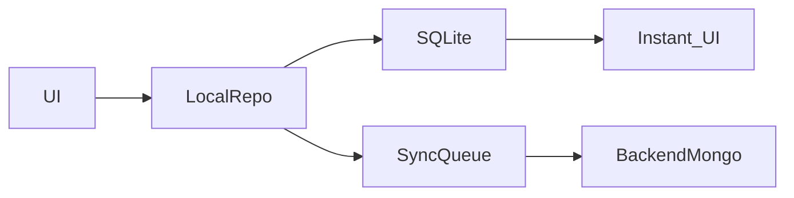

# Shop Local-First Master Plan

**Status:** Documentation / planning only — implementation not started from this doc  
**Branch context:** `feat/local-first-sync` (ledger local-first already shipped)  
**Target decision (locked):** Full offline shop CRUD (option 1) — Personal Cash Book + Local Shop / POS / Inventory / Purchase / Sales / Invoices / P&L, remaining local-first  
**Last audit snapshot:** 2026-09-11 (re-verify before coding)

---

## A. How to use this document in a new chat

1. **Read first (in order):**
   - This file (`docs/SHOP_LOCAL_FIRST_MASTER.md`)
   - [`ENTITY_INVENTORY.md`](./ENTITY_INVENTORY.md)
   - [`OFFLINE_FIRST_PROGRESS.md`](./OFFLINE_FIRST_PROGRESS.md)
   - [`LOCAL_FIRST_IMPLEMENTATION.md`](./LOCAL_FIRST_IMPLEMENTATION.md)
   - [`LOCAL_FIRST_SUPPORT.md`](./LOCAL_FIRST_SUPPORT.md)
   - [`PHASE_2_FOUNDATION.md`](./PHASE_2_FOUNDATION.md)
   - [`mobile/db/README.md`](../mobile/db/README.md)

2. **Re-verify with a fresh codebase audit.** Never assume a library, model, route, table, hook, or API exists. Paths and status below are a snapshot — confirm before changing code.

3. **Do not implement until Phase 1 audit is confirmed** and written back into this doc or a short audit addendum.

4. **Preserve existing Cash Book ledger behavior.** Do not rebuild the app. Do not replace local-first architecture. Extend it.

5. **Implementation order:** Phases 1 → 15 in section H. Do not advance a major phase until the previous is stable.

6. **Copy the starter prompt** at the end of this file into the new chat.

---

## B. Current-state audit summary

> New chats must re-verify. Labels: **Complete** | **Partial** | **API-only** | **Missing** | **Broken / needs fix** | **Doc drift**

### B.1 Stack map

| Area | Location / fact |
|------|-----------------|
| Mobile | Expo SDK ~57, expo-router, TanStack Query v5, SecureStore auth |
| Navigation | `(auth)/` + `(app)/` tabs: Home, Accounts, Transactions, **Shop**, Settings |
| SQLite | `mobile/db/` (client, migrations, repos), DB file `hisabboi_local.db`, expo-sqlite |
| DAL | `mobile/data/*.ts` → `*.local.ts` when local-first ledger scope on |
| Sync | `mobile/sync/engine.ts`, scheduler, pending queue → `/api/sync/*` |
| Flags | `mobile/lib/local-first/flags.ts` — LF **ON**, cloud sync **ON**, dual-write **OFF** |
| Backend | Express **^5.2.1**, Mongoose 8, models under `backend/models/` |
| Sync entities (today) | `account`, `category`, `party`, `transaction`, `transfer` only |

### B.2 Already complete / strong (ledger)

| Item | Notes |
|------|--------|
| Personal + org ledger offline | Accounts, categories, parties, transactions, transfers in SQLite |
| Local-first UX | UI → local repo → SQLite → instant; sync async |
| Sync scope | Mobile pull `scope=all` (personal + org books) |
| Financial sync safety | Server `$inc` on balances; do not trust client balances on push |
| Client invoice PDF | `expo-print` + share via `mobile/services/reports.ts` → `exportInvoicePdf()` |
| Org as business container | `backend/models/Organization.js` (currency, invoice_prefix, etc.) |
| Shop UI shell | `mobile/app/(app)/shop/*` — dashboard, products, invoices, parties |
| Backend catalog | `Product`, `Invoice` (sale/purchase), `StockMovement`, `Party` |
| Barcode UI present | `barcode-scanner-modal.tsx`, `barcode-lookup.ts` (free Open Facts–style lookup) |

### B.3 Partial / API-only (shop)

| Item | Notes |
|------|--------|
| Products | `use-products` → `services/products.ts` → REST only |
| Invoices | `use-invoices` → `services/invoices.ts` → REST only |
| Stock movements | Backend writes on invoice create/cancel; mobile reads via API |
| Shop dashboard stats | Hits `/products/stats`, `/invoices/summary` online |
| Local shop tables | **None** — no `products.local.ts` / `invoices.local.ts` |
| README “POS” | Marketing vs code: actual flow is invoice + catalog, not dedicated POS |

### B.4 Missing relative to product vision

| Item | Notes |
|------|--------|
| Offline shop CRUD | Products, invoices, stock, shop reports without backend |
| Sync for Product / Invoice / StockMovement | Not in sync entity enum |
| Dedicated POS | Scan → cart → qty → pay → done (fast local path) |
| Cost basis fields | No `additional_cost` / `cost_price` / `unit_cost_at_sale` today |
| COGS / P&L | No COGS concept in codebase (grep empty historically) |
| First-class returns | Movement types exist; Invoice types are only `sale` \| `purchase` |
| Daily shop closing | Not implemented |
| Idempotent local inventory | No local movement table / op ids |
| Voice product entry | Not present; optional free/offline STT only if practical |

### B.5 Known fixes / risks (ledger path — re-verify deploy)

| Item | Status at snapshot |
|------|-------------------|
| Express 5 `req.query` assign in `validate.js` | Fixed locally (`assignQuery`) — ensure deployed |
| Account update/delete by Mongo id vs local UUID | Fixed via `resolveLocalAccount` / local `_id` mapping |
| Sync on production | May 404 until `/api/sync/*` deployed |
| Fresh LF install | Empty UI until **Migrate from cloud** |
| Flag defaults in older README/plan docs | Some say OFF; **code defaults ON** — trust code + this doc |

### B.6 Feature inventory (quick)

| Feature | Status |
|---------|--------|
| Cash book income/expense/transfer | Complete (local-first) |
| Categories / accounts / parties | Complete (local-first) |
| Date filters (ledger) | Present — reuse patterns |
| Products (CRUD online) | Partial API-only |
| Barcode scan UI | Partial — **fix actual bug**, do not replace scanner blindly |
| Barcode optional | Intended; enforce in product model (no require) |
| Purchase multi-line invoice | Backend Invoice purchase — online |
| Sales invoice | Backend Invoice sale — online |
| Inventory movements | Backend StockMovement — online |
| Sales/purchase returns UX | Missing as first-class invoices |
| Profit/loss / COGS | Missing |
| Shop dashboard (local queries) | Missing (online stats only) |
| Invoice PDF offline | Client PDF exists; must work with local data |
| Printing / share | expo-print / expo-sharing present |

---

## C. Architecture rules (non-negotiable)



1. **Extend** existing local-first stack (`mobile/db`, `mobile/data`, `mobile/sync`). Do not rebuild.
2. **Daily operations never require the backend.** Backend = sync, backup, multi-device, auth, optional extras.
3. Prefer: UI → local repository → SQLite → instant UI; synchronize separately.
4. **Integrate shop with existing ledger/parties.** Do not invent a parallel “shop accounting” system unless a Phase 1 audit proves isolation is required.
5. **Shop identity (v1):** **Organization = Shop**. Multi-shop = multi-organization. Do **not** add a separate `Shop` entity unless Organization cannot carry settings (currency, tax, invoice numbering, receipt config).
6. **Idempotency:** every sale, purchase, payment, stock movement, return must survive sync retry without duplicates (`client_request_id` / stable local UUIDs / unique op keys).
7. **AI policy:** no paid AI APIs; AI never required for core workflows. Voice = optional free/offline STT behind an abstraction or documented deferral.
8. **External barcode lookup:** optional free/public only; local DB first; app must work with zero external lookup.
9. **Performance:** POS search and barcode lookup must be SQLite-indexed and feel instant; no “UI → API → DB → UI” for normal ops.
10. **Security:** no passwords in SQLite; tokens in SecureStore; strict `admin` / `organization` isolation on every query.

---

## D. Ownership model

| Owner | Owns |
|-------|------|
| **User (Admin)** | Identity, personal cash book (personal-scope accounts/categories/txns), personal prefs, auth |
| **Organization (Shop)** | Products, inventory, sales/purchases/invoices, stock movements, shop settings (currency, invoice prefix/number, tax), shop-scoped parties where `organization` is set |
| **Shared carefully** | Parties may be personal or org-scoped today — **document exact Party scoping before migrating** shop customers/suppliers; avoid duplicating the same person unnecessarily |

**Isolation rule:** Shop A data must not appear in Shop B. Use `organization_id` (and `admin_id`) on every shop table and query.

**Personal Cash Book vs Shop:** User may use personal ledger without any org. Activating a shop means selecting/creating an Organization and scoping shop screens to `useActiveOrgId()` (existing pattern).

---

## E. Proposed schema / sync additions

> Implement only after Phase 1 re-audit. Prefer aligning names with existing Mongo models to ease sync mapping.

### E.1 Reuse / extend (do not duplicate concepts)

| Concept | Existing | Action |
|---------|----------|--------|
| Shop | Organization | Extend settings if needed; no new Shop table |
| Customer/Supplier | Party (`customer` / `supplier` / `both`) | Integrate; shop-scope via `organization` |
| Sale / Purchase header | Invoice (`sale` / `purchase`) | Local table + sync entity |
| Line items | Invoice.items | Local `invoice_items` (or embedded JSON if audit prefers — prefer normalized for queries) |
| Stock audit | StockMovement | Local `inventory_movements` / `stock_movements` |
| Ledger money | Transaction + Account | Create linked txns from shop ops (same patterns as today when invoice posts) |
| Categories | Category | Product category may link existing Category or product_categories — decide in Phase 2 after audit |

### E.2 Candidate SQLite tables

**products**
- `id` (UUID local PK), `server_id`, `organization_id`, `admin_id`
- `name`, `sku`, `barcode` (nullable, unique per org when set), `category_id`, `brand`, `unit`, `description`, `image_uri`
- `purchase_price`, `additional_cost`, `cost_price` (purchase + additional), `selling_price` (sale_price)
- `stock_quantity`, `minimum_stock`, `supplier_party_id`
- `active`, `created_at`, `updated_at`, `deleted_at`
- Sync fields: `sync_status`, `client_request_id`, `version`, etc. (match ledger schema patterns)

**inventory_movements** (align with StockMovement types)
- `id`, `server_id`, `organization_id`, `admin_id`, `product_id`
- `type`: `purchase` | `sale` | `sale_return` | `purchase_return` | `adjustment_in` | `adjustment_out` | `opening_stock`
- `quantity` (signed or signed-by-type — match backend convention)
- `unit_cost`, `stock_after`
- `reference_type`, `reference_id` (invoice / return / adjustment)
- `client_request_id` **UNIQUE** (idempotency)
- `created_at`

**invoices** + **invoice_items**
- Mirror `Invoice`: type `sale` | `purchase` (+ later `sale_return` | `purchase_return` or separate returns tables)
- Items must store **at transaction time:** `unit_price` (selling or purchase as applicable), `unit_cost_at_sale` / cost basis, discount, tax, qty, product_id, barcode snapshot
- Payments array or `payments` table linked to invoice
- Link to party, account, generated ledger transaction ids

**returns** / **return_items** (Phase 8)
- Do not delete original sale/purchase; auditable reverse reference

### E.3 Sync

Extend `backend/routes/sync.routes.js` entity enum and push/pull handlers to include at least:
- `product`
- `invoice` (and items strategy)
- `stock_movement` (or embed movements as side effects of invoice ops with idempotent keys)

Follow ledger patterns: stable local ids, `client_request_id`, soft delete, server authoritative balances for money side-effects.

### E.4 Cost accounting fields (critical)

```
cost_price = purchase_price + additional_cost
gross_profit_per_unit_at_sale = selling_price_on_line - unit_cost_at_sale
```

- **Never** use today’s product `purchase_price` to recompute historical profit.
- Sales revenue uses **selling price on the sale line**, never purchase price.
- Stock valuation (v1): transaction-level stored cost or weighted average — **document which**; no FIFO/LIFO unless required later.

---

## F. Accounting effect matrix

Document effects **before** coding each complex flow. Reconcile with existing debit/credit and invoice posting logic (`CALCULATION_AUDIT.md`, invoice controllers, transaction creation).

| Operation | Revenue | Cash | Receivable | Payable | Stock | COGS | Notes |
|-----------|---------|------|------------|---------|-------|------|-------|
| Cash sale 1000 cost 700 | +1000 | +1000 | — | — | −qty | +700 | Gross profit 300 |
| Credit sale 1000, pay 600 | +1000 | +600 | +400 | — | −qty | +700 | Profit from sale, not cash |
| Purchase 800, pay 500 | — | −500 | — | +300 | +qty | — | Inventory at cost |
| Customer payment 400 | — | +400 | −400 | — | — | — | Not new revenue |
| Supplier payment 300 | — | −300 | — | −300 | — | — | |
| Sale return qty | −rev | ±cash/AR | ± | — | +qty | −COGS | Reverse proportionally; keep original sale |
| Purchase return | — | ±cash/AP | — | ± | −qty | — | |
| Expense 200 | — | −200 | — | — | — | — | Reduces **net** profit |

**P&L (minimum):**
```
Gross Profit = Sales Revenue − COGS
Net Profit   = Gross Profit − Expenses (shop/period scoped)
```

**Do not confuse** cash received with sales revenue.

**Daily closing (target fields):** opening cash, sales, cash sales, credit sales, purchases, expenses, cash in/out, closing cash, gross/net profit — formulas must follow existing accounting model after audit.

---

## G. Product vision checklist (acceptance)

### G.1 Personal Cash Book (must not break)

Income, expense, money received/paid, transfers, customer/supplier/personal accounts, categories, ledger, daily/monthly/yearly and account/category reports, date/time filtering — all existing behavior preserved.

### G.2 Local shop / multi-shop

- Create / edit / archive org (shop), switch shops, configure shop + invoice info, currency, tax, receipt numbering, units, categories
- Simple UI for local shop owners — no unnecessary enterprise features

### G.3 Products

Full product fields per vision; barcode **optional**; cost vs selling price distinction; active/inactive; shop isolation.

### G.4 Inventory

Movements only from business events; auditable history; **idempotent** on sync retry.

### G.5 Purchase

Multi-line purchase invoice; qty/cost/discount/supplier/payment/due; stock up; history; returns where supported; one coherent transaction graph (no orphan inconsistent rows).

### G.6 Sales / POS

Fast local path: Open POS → scan/search → cart → qty/price/discount → payment → complete → stock ↓ → customer ledger if credit → cash/account update → invoice. **No backend wait.**

### G.7 Barcode

Fix root cause (permission, library, camera, events, format, local lookup, navigation, state, parsing). Same barcode rescanned → **qty++** on same cart line. Manual enter/edit/remove. Create product if missing.

### G.8 External lookup & voice

Optional free lookup after local miss; optional free/offline voice behind abstraction — never required.

### G.9 Price history & P&L

Store cost basis on sale lines; historical reports ignore current catalog cost; reports by day/range/month/year/shop/product/category/customer/supplier/invoice/payment method/account; support start/end **time** in local timezone.

### G.10 Invoices PDF

Local preview/save/share/print; shop header fields; offline-capable; extend `reports.ts`.

### G.11 UX priorities

Easy reach: New Sale, Scan, Search Product, New Purchase, Add Product, Customers, Suppliers, Stock, Reports, Ledger.

### G.12 Offline + sync safety

All shop CRUD offline; retry never duplicates sale/purchase/payment/invoice/stock/customer or supplier payment.

---

## H. Implementation phases

**Gate:** Do not start phase N+1 until phase N is stable (tests + Cash Book regression where shared code touched).

| Phase | Focus | Exit criteria |
|-------|--------|----------------|
| **1** | Full audit + architecture freeze + Cash Book regression checklist | Written audit confirm/deny of section B; risks listed; no shop code yet |
| **2** | Product model + local repository + migrate/settings fields | Offline product CRUD; cost fields; org isolation; indexes on barcode/name/sku |
| **3** | Barcode fix + local lookup (+ optional free external) | Scan works; local hit; qty merge; create-if-missing; barcode optional |
| **4** | Inventory movement foundation | Movements table; idempotent writes; stock derived/consistent |
| **5** | Purchase + multi-line purchase invoice | Offline purchase; stock+; supplier due/payment; linked refs |
| **6** | Sales / POS | Offline POS path; stock−; payment modes; instant UI |
| **7** | Customer/supplier accounting integration | Ledger consistent with parties/transactions |
| **8** | Sale + purchase returns | Auditable returns; stock + balances corrected |
| **9** | Profit/Loss + COGS | Historical correctness with stored cost; revenue ≠ cash |
| **10** | Invoice/receipt PDF + print/share | Offline PDF from local invoice |
| **11** | Shop dashboard + reporting + daily closing | Local SQL aggregates; fast dashboard |
| **12** | Advanced shared filtering | Reuse one filter/query utility pattern |
| **13** | Sync integration + idempotency verification | Push/pull products/invoices/movements; retry tests |
| **14** | Backup/recovery/storage for new tables | Backup v3+ includes shop entities |
| **15** | Automated tests | Matrix in section H.1 |

### H.1 Test matrix (minimum)

**Product:** create/update, barcode lookup, duplicate barcode, no barcode  
**Purchase:** single/multi product, stock+, supplier due, payment  
**Sale:** single/multi, repeated barcode → qty, stock−, cash/credit/partial, customer due  
**Returns:** sale return, purchase return  
**Profit:** cost change after old sales, historical profit, discount, returns, expenses  
**Offline:** create sale/purchase/customer/product offline; restart; backend/network down; sync return; duplicate retry; partial sync failure  
**Invoice:** offline generate, numbering, PDF, share  
**Reports:** daily, custom range+time, monthly, yearly, product, category, shop, customer, supplier  

---

## I. Risks to existing Cash Book

| Risk | Mitigation |
|------|------------|
| Shared Party / Transaction / sync engine changes break personal books | Phase 1 document current behavior; add regression tests before extending |
| Org scope regressions (`scope=all`) | Keep personal+org pull; shop entities must filter by active org |
| Balance derivation vs server `$inc` | Shop money side-effects must follow existing sync financial safety rules |
| Migrating cloud products/invoices → SQLite | Idempotent migrate by `server_id`; one-time migrate UX like ledger |
| Dual write accidents | Keep dual-write **OFF**; shop follows same flag model |
| Performance regressions loading large catalogs into JS | DB search/pagination; indexes |
| Invoice cancel vs return semantics | Do not equate cancel with return; design Phase 8 explicitly |
| Timezone bugs in reports | Use local timezone consistently; document storage format (ISO + local display) |

---

## J. Key file map (starting points)

### Mobile
- Flags: `mobile/lib/local-first/flags.ts`
- Ledger scope: `mobile/lib/local-first/ledger-scope.ts`
- DB: `mobile/db/client.ts`, `mobile/db/migrations/index.ts`, `mobile/db/repos/*`
- DAL: `mobile/data/accounts.local.ts`, `transactions.local.ts`, `parties.local.ts`, …
- Sync: `mobile/sync/engine.ts`
- Shop UI: `mobile/app/(app)/shop/`
- Products API: `mobile/services/products.ts`, `mobile/hooks/use-products.ts`
- Invoices API: `mobile/services/invoices.ts`, `mobile/hooks/use-invoices.ts`
- Barcode: `mobile/components/invoices/barcode-scanner-modal.tsx`, `mobile/lib/barcode-lookup.ts`
- PDF: `mobile/services/reports.ts`

### Backend
- Models: `Product.js`, `Invoice.js`, `StockMovement.js`, `Party.js`, `Transaction.js`, `Organization.js`
- Sync: `backend/controllers/sync.controller.js`, `backend/routes/sync.routes.js`
- Validate (Express 5): `backend/middleware/validate.js`
- Invoice/product controllers: `backend/controllers/invoice.controller.js`, `product.controller.js`

---

## K. Related docs

| Doc | Role |
|-----|------|
| [`ENTITY_INVENTORY.md`](./ENTITY_INVENTORY.md) | What is local v1 vs deferred (shop was deferred — this master overrides target) |
| [`OFFLINE_FIRST_PROGRESS.md`](./OFFLINE_FIRST_PROGRESS.md) | What ledger LF already shipped |
| [`LOCAL_FIRST_IMPLEMENTATION.md`](./LOCAL_FIRST_IMPLEMENTATION.md) | Implementation notes / deferred hardening |
| [`LOCAL_FIRST_SUPPORT.md`](./LOCAL_FIRST_SUPPORT.md) | Support / deploy / device QA |
| [`LOCAL_FIRST_PRODUCTION_PLAN.md`](./LOCAL_FIRST_PRODUCTION_PLAN.md) | Broader production plan (flag docs may drift — trust code) |
| [`PHASE_2_FOUNDATION.md`](./PHASE_2_FOUNDATION.md) | Early LF foundation |
| [`../CALCULATION_AUDIT.md`](../CALCULATION_AUDIT.md) | Balance / PDF calculation risks |
| [`../README.md`](../README.md) | Setup paths under `native-apps/cash-book` |

---

## L. New-chat starter prompt (copy-paste)

```
You are extending the Cash Book app at cash-book/ (React Native Expo + Express/MongoDB).

READ FIRST:
- docs/SHOP_LOCAL_FIRST_MASTER.md (source of truth for shop local-first)
- docs/ENTITY_INVENTORY.md
- docs/OFFLINE_FIRST_PROGRESS.md
- docs/LOCAL_FIRST_IMPLEMENTATION.md

LOCKED DECISIONS:
- Do NOT rebuild the app. Extend existing local-first architecture.
- Do NOT break Personal Cash Book ledger behavior.
- Target: full offline shop CRUD (Organization = Shop for v1).
- Daily ops: UI → SQLite → instant UI; sync async; backend optional for daily use.
- No paid AI APIs. Barcode optional. External barcode lookup optional free only.
- Accounting correctness > UI polish. Store cost basis on sale lines. Revenue ≠ cash received.
- Implement phases in order from SHOP_LOCAL_FIRST_MASTER.md; gate each phase.

START NOW:
1. Phase 1 only: full codebase audit (re-verify section B of the master doc).
2. Produce: architecture summary, entity/DB map, API map, product/barcode/invoice analysis, ledger analysis, complete vs broken vs missing, proposed schema diffs, risks to Cash Book.
3. Do NOT modify application code until I approve Phase 1 and say to start Phase 2.
```

---

## M. Out of scope for the documentation step that created this file

- No SQLite migrations, POS UI, sync entity code, or feature commits from the doc-authoring task.
- Implementation begins only when explicitly started (new chat Phase 1, or “execute Phase N”).
